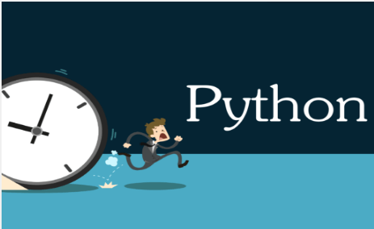

# Python3学习笔记



### 编程语言的基础：
```
  编程语言有多种,尽管不同的编程语言差异极大，最后都得“翻译”成CPU可以执行的机器指令。
  而不同的编程语言，干同一个活，编写的代码量，差距也很大。
  C语言要写1000行代码，Java只需要写100行，而Python可能只要20行。
  Python是一种相当高级的语言。
  代码少的代价是运行速度慢，C程序运行1秒钟，Java程序可能需要2秒，而Python程序可能就需要10秒。
  连Google都在大规模使用Python，你就不用担心学了会没用。
  用Python可以做什么？可以做日常任务，比如自动备份你的MP3；可以做网站，很多著名的网站包括YouTube就是Python写的；
  可以做网络游戏的后台，很多在线游戏的后台都是Python开发的。等等...
```

### 安装python环境：
    略
    注意：windows安装的时候，注意add到环境变量中，否则自己配置到path中。

### HelloWorld：
    - 创建 hello.py
    - 写入： print("hello world")
    - python hello.py

### python基础：
    - 数据类型：
        整型、浮点型、字符串、布尔、空值、列表list、元祖tuple、字典dict/set（set k值不能重复）
        （列表和元祖区别：元祖不可变）
    - 变量：
        直接写，不用声明是什么类型的

    补充：关于list 和 dict 的区别：
        list：
            * 查找和插入的时间随着元素的增加而增加；
            * 占用空间小，浪费内存很少。
        dict：
            * 查找和插入的速度极快，不会随着key的增加而变慢；
            * 需要占用大量的内存，内存浪费多。

### 条件判断和循环：
    条件判断：
        if 表达式:
            语句...
        elif 表达式:
            语句...
        else :
            语句
    循环：
        for 变量 in 对象:
            语句...

        while 语句:
            语句...

### 函数：
    def 函数名(形参):
        语句...

### python高级特性：
  - 切片：

        [:3] 前三项

        [-3:] 后三项

        [:20:2] 取前20项,每隔2项取一次s

        注意一下：字符串也可以切片 元祖tuple都可以

  - 迭代器：

      可以通过for in 遍历，这种遍历叫做迭代

      dict 可以迭代

        1. for k in dict:
              print(k) #key值

        2. for v in dict.values():
              print(v)

        3. for k,v in dict.items():
              print(k,v)

        字符串 可以迭代

### 模块
